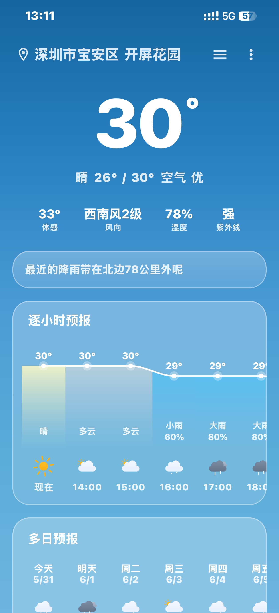

<a id="english"></a>

<div align="center">



# SkyPulse

**English** | [中文](#chinese)

---

[]()
[]()
[]()
[]()
[](LICENSE)
[]()
[]()

A beautifully crafted, feature-rich Android weather app built with **Kotlin** and **Jetpack Compose**, featuring Apple-style weather icons drawn entirely with Canvas API, glassmorphism UI, and smooth animations.

[](https://github.com/qnmlgbd250/weather-none/releases/latest)

</div>

---

## ✨ Highlights

| | Feature | Description |
|---|---|---|
| 🌡️ | **Real-time Weather** | Current temperature, humidity, wind, pressure, visibility, and AQI |
| 🕐 | **48h Hourly Forecast** | Smooth Bezier temperature curve with precipitation probability |
| 📅 | **15-day Daily Forecast** | Temperature range bars with weather icons |
| ⚠️ | **Severe Weather Alerts** | Animated alert carousel with detailed warning information |
| 📍 | **Smart Location** | GPS auto-detection + AMap reverse geocoding, multi-city management |
| 🍎 | **Apple-style Icons** | All weather icons drawn programmatically with Canvas — zero image assets |
| 🔮 | **Glassmorphism UI** | Frosted glass cards with dynamic day/night themes |
| 🎨 | **Dynamic Backgrounds** | Animated weather-themed backgrounds that change with conditions |
| 🖼️ | **Home Widget** | 2×2 widget showing real-time temperature, weather icon, and high/low |
| 🌍 | **Multi-city** | Manage and switch between multiple cities with smooth transitions |

## 📸 Screenshots

<div align="center">

</div>

## 🏗️ Architecture

```
MVVM + Repository Pattern
├── api/            → Retrofit API interface + OkHttp interceptors
├── model/          → Data classes (Moshi codegen)
├── repository/     → Data layer abstraction
├── viewmodel/      → State management with StateFlow & Coroutines
├── worker/         → WorkManager for background widget updates
└── ui/
    ├── components/ → Reusable Compose components (GlassCard, charts, etc.)
    ├── screen/     → Main weather screen, city list, alerts, settings
    ├── widget/     → Glance home widget
    └── theme/      → Colors, typography, Material 3 dynamic theme
```

## 🛠️ Tech Stack

| Category | Technology |
|----------|-----------|
| **UI** | Jetpack Compose, Material 3, Canvas API, Lottie Animations |
| **Architecture** | ViewModel, StateFlow, Coroutines |
| **Networking** | Retrofit 2.9 + Moshi 1.15 (kapt codegen) + OkHttp Logging |
| **Location** | Google Play Services Location + AMap SDK |
| **Permissions** | Accompanist Permissions |
| **Widgets** | Glance + WorkManager |
| **Build** | Gradle KTS, AGP 8.2, Kotlin 1.9, Java 17 |

## 🚀 Getting Started

### Prerequisites

- **Android Studio Hedgehog** (2023.1.1) or later
- JDK 17
- A physical device recommended (for GPS location)

### Build & Run

```bash
# Clone the repository
git clone git@github.com:qnmlgbd250/weather-none.git
cd weather-none

# Open in Android Studio, sync Gradle, and run on device
```

> 💡 **Tip:** Emulator will use default location (Beijing). A physical device is recommended for accurate GPS-based weather.

## ☁️ Weather API

Powered by [Caiyun Weather API](https://docs.caiyunapp.com/) v2.6:

```
GET /v2.6/{token}/{lon},{lat}/weather?alert=true&dailysteps=15&hourlysteps=48
```

## 📦 Download

<div align="center">

[](https://github.com/qnmlgbd250/weather-none/releases/latest)

</div>

## 🤝 Contributing

Contributions are welcome! Feel free to:

1. Fork the repository
2. Create a feature branch (`git checkout -b feature/amazing-feature`)
3. Commit your changes (`git commit -m "feat: add amazing feature"`)
4. Push to the branch (`git push origin feature/amazing-feature`)
5. Open a Pull Request

## 📄 License

This project is licensed under the MIT License — see the [LICENSE](LICENSE) file for details.

---

<div align="center">

### ⭐ Star History

[](https://star-history.com/#qnmlgbd250/weather-none&Date)

</div>

---

<a id="chinese"></a>

# 中文

<div align="center">


# SkyPulse

**[English](#english)** | 中文

---

[]()
[]()
[]()
[]()
[](LICENSE)
[]()
[]()

一款精心打造的 Android 天气应用，使用 **Kotlin** + **Jetpack Compose** 构建，采用纯 Canvas API 绘制苹果风格天气图标，搭配毛玻璃 UI 和丝滑动画。

[](https://github.com/qnmlgbd250/weather-none/releases/latest)

</div>

---

## ✨ 功能亮点

| | 功能 | 说明 |
|---|---|---|
| 🌡️ | **实时天气** | 当前温度、湿度、风力风向、气压、能见度、空气质量 |
| 🕐 | **48小时预报** | 贝塞尔曲线平滑温度图，逐时降水概率 |
| 📅 | **15天预报** | 温度区间条 + 天气图标，一目了然 |
| ⚠️ | **灾害预警** | 动画轮播预警信息，点击查看详细预警内容 |
| 📍 | **智能定位** | GPS 自动定位 + 高德逆地理编码，支持多城市管理 |
| 🍎 | **苹果风格图标** | 所有天气图标纯 Canvas 绘制，零图片资源 |
| 🔮 | **毛玻璃 UI** | 磨砂玻璃卡片，日夜主题动态切换 |
| 🎨 | **动态背景** | 天气主题动画背景，随天气变化实时切换 |
| 🖼️ | **桌面小组件** | 2×2 小组件，显示实时温度、天气图标、最高/最低温 |
| 🌍 | **多城市** | 多城市管理，平滑切换动画 |

## 📸 截图

<div align="center">

</div>

## 🏗️ 项目架构

```
MVVM + Repository 模式
├── api/            → Retrofit API 接口 + OkHttp 拦截器
├── model/          → 数据类（Moshi codegen 生成）
├── repository/     → 数据层抽象
├── viewmodel/      → StateFlow 状态管理 + 协程
├── worker/         → WorkManager 后台小组件更新
└── ui/
    ├── components/ → 可复用 Compose 组件（GlassCard、图表等）
    ├── screen/     → 主天气页面、城市列表、预警、设置
    ├── widget/     → Glance 桌面小组件
    └── theme/      → 颜色、排版、Material 3 动态主题
```

## 🛠️ 技术栈

| 类别 | 技术 |
|------|------|
| **UI** | Jetpack Compose, Material 3, Canvas API, Lottie 动画 |
| **架构** | ViewModel, StateFlow, Coroutines |
| **网络** | Retrofit 2.9 + Moshi 1.15 (kapt codegen) + OkHttp Logging |
| **定位** | Google Play Services Location + 高德 SDK |
| **权限** | Accompanist Permissions |
| **小组件** | Glance + WorkManager |
| **构建** | Gradle KTS, AGP 8.2, Kotlin 1.9, Java 17 |

## 🚀 快速开始

### 环境要求

- **Android Studio Hedgehog** (2023.1.1) 或更高版本
- JDK 17
- 建议使用真机（GPS 定位需要）

### 构建运行

```bash
# 克隆仓库
git clone git@github.com:qnmlgbd250/weather-none.git
cd weather-none

# 用 Android Studio 打开，同步 Gradle，运行到设备
```

> 💡 **提示：** 模拟器默认使用北京作为定位位置，建议使用真机以获得准确的 GPS 定位天气。

## ☁️ 天气 API

由 [彩云天气 API](https://docs.caiyunapp.com/) v2.6 提供数据：

```
GET /v2.6/{token}/{lon},{lat}/weather?alert=true&dailysteps=15&hourlysteps=48
```

## 📦 下载

<div align="center">

[](https://github.com/qnmlgbd250/weather-none/releases/latest)

</div>

## 🤝 参与贡献

欢迎参与贡献！你可以：

1. Fork 本仓库
2. 创建功能分支 (`git checkout -b feature/amazing-feature`)
3. 提交更改 (`git commit -m "feat: add amazing feature"`)
4. 推送到远程 (`git push origin feature/amazing-feature`)
5. 提交 Pull Request

## 📄 开源协议

本项目基于 MIT 协议开源 — 详见 [LICENSE](LICENSE) 文件。

---

<div align="center">

### ⭐ Star 趋势

[](https://star-history.com/#qnmlgbd250/weather-none&Date)

如果觉得不错，请给个 ⭐ Star 支持一下！

</div>

---

<div align="center">

<p>如果觉得项目不错，请作者喝杯咖啡吧 ☕</p>
</div>

